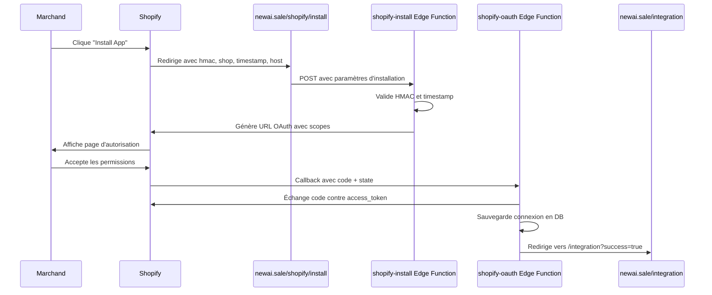

# Configuration OAuth Shopify - Guide Complet

## Problème Résolu

Votre application Shopify renvoyait une erreur lors de l'installation :
```
URL attendue : https://admin.shopify.com/store/uvszh1-m5/app/grant
URL réelle : https://newai.sale/?hmac=...
```

Cette erreur se produit parce que l'application ne gérait pas correctement le flux d'installation initial de Shopify.

## Solution Implémentée

### 1. Fichiers Créés

- **Page d'installation** : `/src/pages/ShopifyInstall.tsx`
  - Gère la requête d'installation de Shopify avec les paramètres `hmac`, `shop`, `timestamp`, `host`
  - Valide les paramètres et lance le flux OAuth

- **Edge Function** : `supabase/functions/shopify-install/index.ts`
  - Valide le HMAC envoyé par Shopify
  - Vérifie la fraîcheur du timestamp (max 5 minutes)
  - Génère l'URL OAuth avec tous les scopes nécessaires
  - Supporte les installations publiques (sans utilisateur connecté)

### 2. Route Ajoutée

```typescript
<Route path="/shopify/install" element={<ShopifyInstall />} />
```

## Configuration Requise dans Shopify Partner Dashboard

Pour que l'installation fonctionne correctement, vous DEVEZ configurer les URLs suivantes dans votre **Shopify Partner Dashboard** :

### Étapes de Configuration :

1. **Accédez à votre Shopify Partner Dashboard**
   - Allez sur https://partners.shopify.com
   - Connectez-vous avec votre compte Partner

2. **Sélectionnez votre Application**
   - Dans le menu, cliquez sur **Apps**
   - Sélectionnez votre application dans la liste

3. **Configurez les URLs**
   - Allez dans **Configuration** → **App setup** → **URLs**
   
   **App URL** (URL de l'application) :
   ```
   https://newai.sale/shopify/install
   ```
   
   **Allowed redirection URL(s)** (URLs de redirection autorisées) :
   ```
   https://nekqqlhrjgmyudmmewas.supabase.co/functions/v1/shopify-oauth
   ```

4. **Sauvegardez les Modifications**
   - Cliquez sur **Save** en haut à droite

## Flux OAuth Complet



## Paramètres d'Installation

Lorsque Shopify lance l'installation, il envoie ces paramètres :

- **hmac** : Signature HMAC pour valider l'authenticité de la requête
- **shop** : Le domaine myshopify.com de la boutique (ex: `uvszh1-m5.myshopify.com`)
- **timestamp** : Timestamp Unix de la requête
- **host** : Paramètre d'identification Shopify encodé en base64

## Scopes Demandés

L'application demande les permissions suivantes :

```typescript
[
  "write_checkout_branding_settings",
  "write_checkouts",
  "read_files", "write_files",
  "write_inventory", "read_inventory",
  "write_inventory_shipments", "read_inventory_shipments",
  "write_inventory_shipments_received_items", "read_inventory_shipments_received_items",
  "write_inventory_transfers", "read_inventory_transfers",
  "read_online_store_pages", "write_online_store_pages",
  "read_product_feeds", "write_product_feeds",
  "read_product_listings", "write_product_listings",
  "read_products", "write_products",
  "read_shipping", "write_shipping",
  "unauthenticated_read_product_pickup_locations",
  "unauthenticated_read_product_inventory",
  "unauthenticated_read_product_listings",
  "unauthenticated_read_product_tags",
  "read_orders",
  "read_content", "write_content"
]
```

## Validation de Sécurité

### HMAC Validation

L'application valide automatiquement le HMAC pour garantir que la requête provient bien de Shopify :

1. Extrait tous les paramètres sauf `hmac`
2. Trie les paramètres par ordre alphabétique
3. Crée une chaîne de requête : `key1=value1&key2=value2...`
4. Calcule le HMAC SHA-256 avec `SHOPIFY_API_SECRET`
5. Compare avec le HMAC fourni par Shopify

### Timestamp Validation

L'application vérifie que la requête n'est pas trop ancienne (maximum 5 minutes) pour éviter les attaques par rejeu.

## Gestion des Cas d'Usage

### Installation Publique (Nouveau Marchand)

1. Marchand clique "Install" sur l'App Store
2. Shopify redirige vers `/shopify/install`
3. Validation HMAC et génération OAuth URL
4. Marchand autorise les permissions
5. Après OAuth, redirection vers `/auth` pour créer un compte
6. Une fois connecté, la connexion Shopify est établie

### Installation par Utilisateur Connecté

1. Utilisateur connecté utilise le bouton OAuth dans `/integration`
2. Génération d'un state token stocké en DB avec user_id
3. Flux OAuth standard
4. Connexion automatique à la boutique

## Variables d'Environnement Requises

Ces secrets doivent être configurés :

- `SHOPIFY_API_KEY` : Votre API Key Shopify
- `SHOPIFY_API_SECRET` : Votre API Secret Shopify
- `APP_URL` : URL de votre application (https://newai.sale)

## Test de l'Installation

### Via Shopify Partner Dashboard

1. Allez dans **Apps** → Votre app → **Test on development store**
2. Sélectionnez un store de développement
3. Cliquez sur **Install app**
4. L'installation devrait maintenant fonctionner correctement

### URLs de Test

- **Installation** : `https://newai.sale/shopify/install?hmac=...&shop=...&timestamp=...`
- **OAuth Callback** : Géré automatiquement par `shopify-oauth` edge function
- **Success Page** : `https://newai.sale/integration?success=true`

## Dépannage

### Erreur "Invalid HMAC"

- Vérifiez que `SHOPIFY_API_SECRET` est correctement configuré
- Vérifiez que les paramètres ne sont pas modifiés en cours de route
- Vérifiez que l'App URL est correctement configurée dans Shopify Partner Dashboard

### Erreur "Request Expired"

- Le timestamp est trop ancien (>5 minutes)
- Réessayez l'installation

### Erreur "Missing Required Parameters"

- Vérifiez que Shopify envoie bien : `hmac`, `shop`, `timestamp`
- Vérifiez la configuration de l'App URL dans Partner Dashboard

## Documentation Shopify

Pour plus d'informations sur le flux OAuth Shopify :
- [OAuth Documentation](https://shopify.dev/docs/apps/build/authentication-authorization/access-tokens/authorization-code-grant)
- [App Installation Requirements](https://shopify.dev/docs/apps/launch/app-requirements)
- [HMAC Validation](https://shopify.dev/docs/apps/build/authentication-authorization/hmac-validation)
